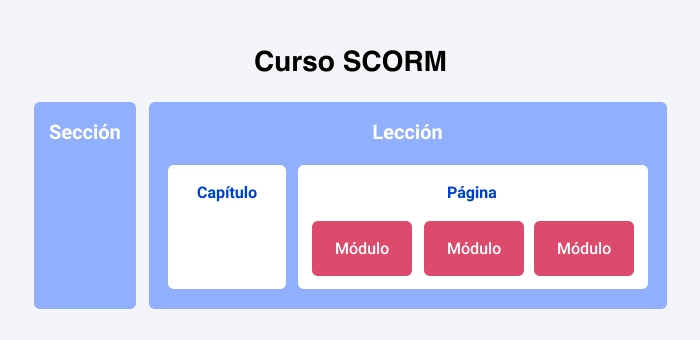

# Guía 2da Unidad

## Índice

- [Guía 2da Unidad](#guía-2da-unidad)
  - [Índice](#índice)
  - [Plataformas educativas virtuales](#plataformas-educativas-virtuales)
    - [Historia](#historia)
    - [Características](#características)
    - [¿Qué elementos necesita tener una plataforma educativa para cumplir con su función?](#qué-elementos-necesita-tener-una-plataforma-educativa-para-cumplir-con-su-función)
      - [LMS](#lms)
      - [LCMS](#lcms)
    - [Tipos de plataformas educativas virtuales](#tipos-de-plataformas-educativas-virtuales)
  - [SCORM](#scorm)
    - [Beneficios del formato SCORM](#beneficios-del-formato-scorm)
  - [GPL](#gpl)

## Plataformas educativas virtuales

Una plataforma educativa virtual es un programa que engloba diferentes tipos de herramientas destinadas a fines docentes. Su principal función es facilitar la creación de entornos virtuales para impartir todo tipo de formaciones a través de internet sin necesidad de tener conocimientos de programación pero que sí requieren de capacitación tecnológica para su uso.

En realidad son programas que permiten hacer tareas como: organizar contenidos y actividades dentro de un curso online, gestionar las matriculaciones de los estudiantes, tener un seguimiento de trabajo durante el curso, resolver dudas y crear espacios de comunicación interactiva, evaluar los progresos de los alumnos, etc.

Pueden utilizarse para gestionar de manera integral formaciones a distancia o como un complemento de la docencia presencial. Aunque cada vez más también se emplean para crear espacios de discusión y trabajo para grupos de investigación, o para implementar comunidades virtuales y redes de aprendizaje en torno a temas de interés común.

### Historia

Son múltiples las plataformas comerciales que existendesde su aparición, algunas de ellas son **Blackboard**, **FirstClass** y **WebCt**, etc.

En lo que se refiere a **Blackboard**, es una de las más representativas e incluso ha
obtenido diferentes premios desde su creación en **1997**. Esta plataforma se ha posicionado
en este entorno con una visión de cara al futuro. Busca contribuir con los profesores,
estudiantes, instituciones y empresas a crecer y desenvolverse mejor en un ambiente hostil
y riguroso.

Por otro lado, en lo que se refiere al tema de los precios, al igual que otras plataformas,
Blackboard no suministra su información de manera pública, para conocer sus tarifas se
requiere hacer una solicitud formal a dicha plataforma y la misma otorga sus precios según
el requerimiento y necesidades que se acoplen a cada cliente. Aunque no es pública la
información, se rumora que es un tanto elevada.

En el caso de **WebCT**, se dedica a los cursos por web, fue diseñada por la Universidad
British Columbia de Canadá, contó con un gran desarrollo y se expandió de manera muy
rápida. El hecho de que en este mercado exista gran versatilidad de instrumentos para la
elaboración de cursos lo hace muy demandado por los profesores; en él se pueden
experimentar diferentes técnicas e instrumentos para la elaboración de clases en sus cursos, como contenidos en diversidad de formatos, páginas web, foros, correo electrónico, entre otros.

En tanto, **FirsClass** se conoce como una interacción entre cliente y servidor basada en
conferencias en líneas, servicios de voz/fax, sistemas operativos como Windows, Linux y
Macintosh. Da la libertad de diseñar, regular, establecer y administrar un real campo
virtual a través del cual la población estudiantil y docente tienen amplios entornos de
enseñanza y compartimiento de información. Se considera la primera plataforma educativa y fue publicada desde 1990.

### Características

Entre las características más destacables de una plataforma virtual se consideran las siguientes:

- Brindar seguridad en el acceso: el acceso debe estar restringido a cada usuario, según su perfil y sin la posibilidad de entrar si no está registrado.
- Interacción: entre los alumnos y entre éstos y el docente.
- Entorno intuitivo: la navegación dentro del portal debe ser lo más sencilla posible y siguiendo siempre las mismas pautas.
- Diversidad de recursos para la formación y la comunicación: debe contar con diferentes tipos de herramientas posibles, tanto para la formación del alumno como para la comunicación entre los usuarios.
- Acceso a la información: debe proporcionar diversidad de recursos que posibiliten el acceso a la información y su estructuración como base de datos, bibliotecas virtuales, tutoriales, etc.

### ¿Qué elementos necesita tener una plataforma educativa para cumplir con su función?

Para poder desempeñar su cometido, una plataforma educativa debe de estar compuesta por diferentes herramientas:

- **LMS** _(Learning Management System)_: Es el lugar en el que se encuentran y contactan todos los usuarios de la plataforma: alumnos, profesores, personal administrativo. Aquí es donde son presentados los cursos a los usuarios y donde se realiza el seguimiento de los progresos del alumno durante el tiempo que dure la formación.
- **LCMS** _(Learning Content Management System)_: Es la herramienta que permite la gestión y publicación de los contenidos utilizados en el curso.
- **Herramientas de comunicación**: Favorecen la participación de los estudiantes creando espacios dedicados al trabajo en común y el intercambio de información. Normalmente se hace a través de chats, foros, correos electrónicos, intercambio de ficheros, etc.).
- **Herramientas de administración**: Permite la gestión de las inscripciones, diferentes permisos de acceso dentro de la plataforma a los distintos usuarios, etc.

Además de los elementos ya mencionados, algunos otros aspectos técnicos deben tomarse en cuenta:

- :triangular_ruler: **Personalización**: Integración de tu imagen y valores académicos para familiarizar a los alumnos y dotarlos de sentido de identidad.
- :performing_arts: **Adaptabilidad**: Tener la capacidad de integrarse orgánicamente a nuestras necesidades, tanto particulares como generales.
- :iphone: **Flexibilidad**: Posibilidad de conectarse y acceder desde cualquier punto con la menor dificultad posible.
- :recycle: **Disponibilidad**: Contar con soporte técnico para ofrecer todos los recursos de manera eficiente las 24 horas del día.
- :rainbow: **Versatilidad**: Estar al tanto de las actualizaciones y mejoras de los recursos tecnológicos y educativos que aparecen en el mercado.

#### LMS

La plataforma LMS (Learning Management System), plataforma educativa web,
plataforma E-learning o Entorno Virtual de Enseñanza y Aprendizaje, se describe como
una aplicación web que constituye ciertos instrumentos pedagógicos que fomentan el
conocimiento dentro del aprendizaje virtual o en línea, lo cual establece un aprendizaje no presencial (E-learning) o combinada (b-learning), en esta última se contemplan tanto enseñanzas virtuales como en clases presenciales (Pampillón, 2008).

Desde el punto de vista informático, se conoce como ambiente virtual a la interfaz que se encarga de apoyar los procesos de aprendizaje y búsqueda de conocimiento que apoya a las diversas instituciones educativas. Britain (como se citó en Valderrama, 2019).

Un sistema LMS está compuesto por diversos servicios tanto desde el punto de vista del docente como el usuario, de acuerdo con Britain (como se citó en Valderrama, 2019), lo plantea de la siguiente manera:

Desde la perspectiva del docente:

- Elaboración pedagógica de cursos de enseñanza.

- Acciones propias de lugares para la labor del profesor y su investigación.
- Gestión conjunta de sus lugares de trabajos (historia, bajas, altas, suministro de datos entre ellos).
- Inclusión de instrumentos pedagógicos de apoyo, por ejemplo, los repositorios.

Desde la perspectiva del estudiante:

- Ingreso a los cursos en lo que se haya inscrito.
- Supervisión de su avance académico.
- Disposición para elaborar modificación de labores que fomenten la creación de sus
enseñanzas.

Desde la perspectiva del administrador del sistema:

- Elaboración de aplicaciones y actualización de las vigentes, de acuerdo con los
requerimientos de estudiantes y docentes.
- Establecer una estructura con aceptación visual.
- Descripción de las herramientas de interoperabilidad.
- Supervisión y manejo de tiempos de conectividad (cantidad de usuarios, tiempo de
respuestas de las aplicaciones, número de conexiones, entre otros).

En este mismo contexto, se determina que los diversos instrumentos de un LMS
determinan la posibilidad de ejecutar cinco actividades específicas. Si bien es cierto que cada LMS posee sus propias herramientas, a continuación, y de acuerdo con Valderrama (2019) plantearemos dichas actividades para tener una visión global:

- **Administración**: los instrumentos deben suavizar las operaciones que realicen los usuarios, entiéndase estas como altas, borrado, modificaciones, disposición de la lista de clases. Así como también,incorporación, descripción de criterios, actualización o modificación de plantillas.
- **Comunicación**: los instrumentos de comunicación garantizan la interacción entre
estudiantes y docentes. Esta puede ser por correo electrónico, blogs y foros de ayuda, o también por medio de chats (charlas) e incluso pizarra virtual electrónica.
Básicamente busca una comunicación muy interactiva que puede ir de estudiante a
docente o viceversa.
- **Gestión de contenidos**: para llevar a cabo la gestión de contenidos los LMS usan un
sistema de almacenaje y tramitación de archivos que buscan desarrollar operaciones sobre ellos, bien sea de visualización, organización de carpetas, copiar y pega, eliminar y comprimir. Por lo general se suele usar sistemas para publicar de manera organizada los contenidos de los archivosrequeridos. No es necesario que se disponga de archivos específicos para las publicaciones, sin embargo, si se requiere que disponga instalada de la aplicación específica.
- **Gestión de grupos**: estos instrumentos garantizan hacer labores de alta, cambios o borrados de conjuntos de estudiantes, y a su vez; crear espacios virtuales para que se desarrollen trabajos de interacción con los participantes de los grupos.
- **Evaluación**: los instrumentos empleados para llevar a cabo la evaluación disponen opciones para crear, editar y realizar gran variedad de test (exámenes virtuales), dar la autocorrección, la nota obtenida e incluso poder visualizar la información estadística tanto grupal como individual.

#### LCMS

Para entender cómo funcionan los LCMS, Enríquez (2004) plantea que en la actualidad
la educación está más direccionada en _"como aprender"_ en lugar de _"que aprender"_. Por lo general se fomenta la capacitación de los seres humanos en sus facultades y habilidades que tienden a desarrollar grados de análisis y responsabilidades para encajar luego en el ámbito laboral.

El E-learning se plantea como la capacidad de dar enseñanzas en el momento y lugar
exacto. Los alumnos poseen accesibilidad a un repositorio de conocimientos y; cuando van respondiendo sus preguntas tienden a tener la cantidad de información que le es necesaria, teniendo en cuenta su información previa, formas de aprendizaje y metas, en este momento es que se determina la enseñanza personalizada y flexible. Por ende, se requiere que se genere una evolución de los LMS hacia los LCMS (Learning Content Management Systems) que, se diferencian de los LMS en que están dirigidos a la formulación y administración de contenidos, de una forma pedagógica, de tal manera que da la opción de modificar y llevar a cabo la creación de aprendizajes que sirvan para responder a las necesidades y diseños específicos del conocimiento. (Enríquez , 2004).

De acuerdo con Greenberg y Williams (como se citó en Enríquez, 2004), los componentes que deben suministrar los LCMS son:

- **Repositorio de objetos de aprendizaje**: estas son bases de datos que acoplan todo
tipo de información digital y aprendizajes que constituyen las asignaciones, unidades
pedagógicas y cursos que se desarrollan. Se pueden visualizar y utilizar por los
diversos usuarios sin perjudicar la información inicial.
- **Herramientas de auditoria**: son instrumentos que se plantean en la creación de
objetos de enseñanzas, que también son archivados en el repositorio. Se consideran
formatos básicos como XML y SCORM.
- **Herramientas de publicación**: se elaboran para que los miembros puedan verificar
los objetos de aprendizaje que han sido diseñaos por otros miembros. Se consideran
los formatos de las publicaciones (XML y SCORM) y también formatos distintos de
repartición.
- **Herramientas de colaboración**: es fundamental para impulsar la educación
combinada suministrar instrumentos que fomenten la elaboración de equipos de
trabajo, estableciendo posibilidades y permisos de modificación y comunicación por
parte de los usuarios de los equipos.
- **Interfaz dinámica**: es un miembro vital para lograr suministrar la información,
medios de evaluación, dinámicas o actividades, que se debe modernizar para los
diversos grupos de usuarios de acuerdo con los requerimientos que necesiten.
- **Aplicación administrativa**: menciona las partes que conforman y permiten tener un
control y supervisión del desarrollo de cada uno de sus usuarios, archivando los
perfiles y particularidades personales.

Todos estos elementos unidos a las experiencias logradas a través del uso de los LMS
en materia de elaboración de instrumentos de comunicación y nuevos estándares para la
interoperabilidad en los diversos repositorios de enseñanza permiten, no nada más ampliar la diversidad de contenidos académicos, sino la labor colaborativa entre instituciones, empresas y docentes. Para que los contenidos sean compatibles, transparentes, modulados, se respeten las patentes debe plantearse una guía a seguir en cuanto al diseño y desarrollo de plataformas. Uno de los mayores retos es incorporar y aceptar esta nueva metodología de formación y trabajo (Enríquez , 2004).

### Tipos de plataformas educativas virtuales

Existen diferentes tipos de plataformas educativas según el tipo de actividad al que estén destinadas.

|Tipo|Descripción|Ejemplos|
|-|-|-|
|Plataformas educativas comerciales|Han sido creadas por empresas o instituciones educativas con fines lucrativos. Suelen tener muy buena fiabilidad y asistencias técnicas eficaces. Requieren del pago de una cuota, generalmente anual que da acceso a las sucesivas actualizaciones. Las más importantes tienen cantidad de módulos especializados diferentes que permiten que adaptes la plataforma totalmente a tus necesidades|Algunas de las más conocidas son: [WebCT](https://es.wikipedia.org/wiki/WebCT), [FirstClass](https://www.comparasoftware.com/firstclass-lms), [Google Workspaces for Education](https://www.youtube.com/watch?v=XQ0Ja_vaM0o&ab_channel=GoogleforEducation)|
|Plataformas de software libre|Son creadas sin fines lucrativos. Sus ventajas principales son que el programa es libre para ser usado con cualquier finalidad, es posible adaptarlo a tus necesidades o distribuir copias y no es necesario pagar para tener acceso a las actualizaciones|Algunas plataformas educativas de software libre son por ejemplo: [Moodle](https://moodle.org/?lang=es), [Claroline](https://es.wikipedia.org/wiki/Claroline)|
|Plataformas de desarrollo propio|No están pensadas para distribuirse de forma masiva porque han sido desarrolladas a medida para un proyecto determinado. La ventaja es que son totalmente personalizadas a las necesidades del proyecto y responden mejor a las necesidades educativas y pedagógicas del mismo. La principal desventaja es que no son fácilmente generalizables a otros campos y su elevado coste.|[Harmon hall](https://www.harmonhall.com/), etc.|

El uso de las plataformas educativas está revolucionando la forma en la que aprendemos, abriendo nuevas e interesantes posibilidades que superan los límites del tiempo y el espacio para que la formación ya no tenga fronteras.

## SCORM

SCORM son las siglas en inglés de Shareable Content Object Reference Model, que en español podemos traducir como Modelo de Referencia para Objetos de Contenido Compartible. Es un estándar internacional para cursos de e-learning. Si tu curso ha sido publicado en formato SCORM, puedes estar seguro de que casi todos los sistemas de gestión de aprendizaje, o LMS por sus siglas en inglés Learning Management System, lo reconocerán.

De hecho, SCORM, es una lista de requisitos técnicos. Esta lista nos dice cómo hacer un curso que funcionará en cualquier plataforma; contiene una descripción detallada de la estructura del curso de e-learning y los principios de su interacción con los _LMS_.

### Beneficios del formato SCORM

**Compatibilidad**. Casi cualquier LMS reconocerá un curso SCORM.

**Guardar el progreso**. Un estudiante no tiene que hacer todo el curso del tirón. Puede hacerse paso a paso. Media hora de trabajo, 10 minutos de descanso, y el estudiante puede continuar la lección desde donde la dejó. Todo el progreso permanece guardado. Esto también es conveniente cuando el sistema falla o el curso se cierra ocasionalmente.

**Feedback**. Podrás evaluar el progreso de los estudiantes. Cuando Joe College complete el curso de e-learning, el sistema mostrará cuántos puntos ha obtenido, o se mostrará el estado "Curso completado".

**Una estructura de curso clara**. Puedes crear una estructura clara para el curso y establecer las reglas para moverse entre sus secciones. Por ejemplo, los estudiantes quizás necesiten estudiar una clase primero, luego ver un video, y solo después pueden hacer la evaluación final.

**Modularidad**. En un curso SCORM, los materiales de formación consisten en unidades individuales, o módulos. Cada módulo puede ser usado en cualquier otro curso dentro del LMS.

## GPL

La **Licencia Pública General de GNU** o más conocida por su nombre en inglés **GNU General Public License** (o simplemente sus siglas en inglés **GNU GPL**) es una licencia de derecho de autor ampliamente usada en el mundo del software libre y código abierto,​ y garantiza a los usuarios finales (personas, organizaciones, compañías) la libertad de usar, estudiar, compartir (copiar) y modificar el software. Su propósito es doble: declarar que el software cubierto por esta licencia es libre, y protegerlo (mediante una práctica conocida como copyleft) de intentos de apropiación que restrinjan esas libertades a nuevos usuarios cada vez que la obra es distribuida, modificada o ampliada. Esta licencia fue creada originalmente por Richard Stallman, fundador de la Free Software Foundation (FSF) para el proyecto GNU.

La Free Software Foundation pone la GPL a disposición de cualquiera que desee proteger los derechos de sus usuarios finales (usar, compartir, estudiar y modificar), y otorgar a los beneficiarios de un programa de ordenador u otro tipo de obra los derechos de la definición de software libre.7​ La GPL se distingue del dominio público o de otras licencias de software libre conocidas como permisivas por hacer hincapié en el copyleft, o solo permitir que las copias y derivados de una obra bajo la GPL perpetúen la misma licencia.

La mayor parte del software GNU es copyleft, pero no todo; sin embargo, todo el software GNU debe ser software libre.
